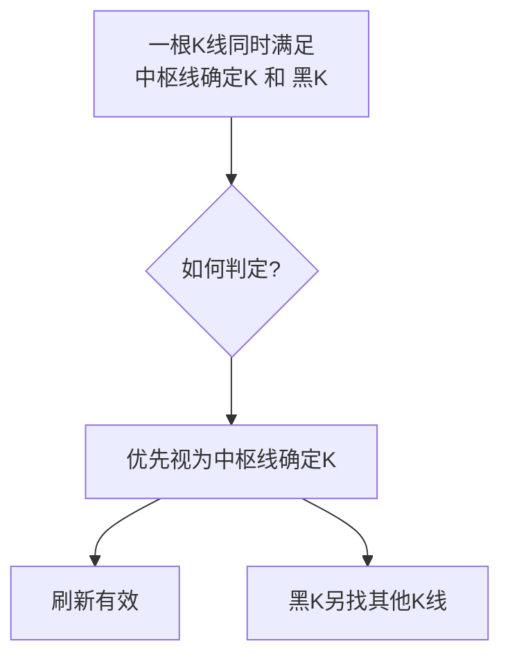

# 课8：本质线段中枢之唯一选取（三）

## 一句话摘要

线段中枢唯一选取的收官之讲：重点解决 **「形成当下」** 时中枢线是否刷新的难点——通过独立K的精确定义（不参与前一中枢构造）和形成当下的临界处理法则，结合非肉与肉重叠时的重组法则对刷新的影响，最终完成静态线段中枢唯一的全部知识。

---

## 一、课程定位

| 维度 | 说明 |
|------|------|
| 所属阶段 | 第一阶段：线段中枢（课2~课9） |
| 前置知识 | 课2~课7：中枢线k0/k体系、起手三式、黑K确认、肉/非肉、唯一选取（一）（二） |
| 上节课 | [[courses/课07-线段中枢唯一选取二]] — k0/k刷新 + 延伸与重组法则 |
| 在体系中的位置 | 唯一选取系列第三讲（最后一讲）：解决形成当下的临界判定难题 |
| 核心作用 | 在时间当下（中枢刚刚形成的那一刻），准确判断中枢线是否刷新，这是实战中的最大难点 |
| 下节课 | [[courses/课09-线段中枢综合融会贯通]] — 线段中枢综合融会贯通 |

> **定位总结**：课8是线段中枢唯一选取的收官之讲。后续将进入线段的顶底学习（课10~课15）。本课完成后，线段中枢的**静态**唯一选取知识全部结束。

---

## 二、前后知识衔接

### 2.1 已学知识链

```
课2：中枢线定义（k0 + k配对）
  → 课3：起手三式（反正两穿/三笔/5k重叠）
    → 课4：黑K确认 + 肉/非肉引入
      → 课5：中枢取值（肉/非肉上下轨取值规则）
        → 课6：唯一选取（一）— 相邻两中枢不重叠三法则
          → 课7：唯一选取（二）— k0/k刷新 + 延伸与重组
            → 本课（课8）：唯一选取（三）— 形成当下临界处理 + 独立K深化
```

### 2.2 核心理念

> **不要混淆法则与应用。法则（k0/k刷新、独立K等）是底层不变的；应用（肉/非肉、延伸/重组）是在不同环境下使用法则，不改变法则本身。**

底层法则固定，但应用环境变化会导致前提条件改变——思维的关键在于区分"法则"和"法则在不同环境下的表现"。

---

## 三、形成当下的临界处理

### 3.1 什么是"形成当下"？

"形成当下"是指：**前一中枢刚刚完成（起手三式的最后一天），新的中枢线确定K恰好在这一天出现的临界状态。**

此时面临核心判断：新的中枢线确定K是否刷新有效？

### 3.2 临界处理核心法则

| 场景 | 新中枢线确定K的角色 | 判断 | 原因 |
|------|---------------------|------|------|
| 场景A | 是前一中枢起手三式的**最后一天**（构造K） | ❌ 刷新无效 | 参与了前一中枢构造，不满足独立K |
| 场景B | 是前一中枢的**黑K**（但非最后一天） | ✅ 刷新有效 | 黑K不算"构造K"，独立K条件满足 |

> **关键结论**：唯一一种刷新无效的情形 —— 中枢线确定K恰好是前一中枢起手三式的最后一天（构造K）。

### 3.3 "不参与前一中枢构造"的精确含义

中枢线确定K若参与前一中枢的构造，只有两种可能：

1. **作为前一中枢起手三式的最后一天**（例如5k重叠的第5根K线）→ 刷新无效
2. **作为前一中枢的黑K** → 刷新有效（黑K不算是"构造K"）

除此之外，不存在其他"参与"情况。

### 3.4 刷新有效后的处理

> **"旧的不死，新的不来"** —— 以时间当下为顺序，刷新后前方已死。

- 一旦中枢线刷新有效，原中枢线即刻无效
- 所有中枢成立法则（起手三式+黑K）以**新中枢线为主体重新开始**

### 3.5 黑K与中枢线确定K的关系



**法则**：中枢线确定K不能是黑K（否则所有线段中枢都有黑K，黑K失去保障意义）。若二者冲突，**中枢线确定K优先**，黑K另寻他处。

---

## 四、独立K刷新法则深化

### 4.1 独立K的两层含义

| 层面 | 定义 | 关键 |
|------|------|------|
| **空间独立** | K线价格完全在前一中枢区域之外，最高最低不进入 | 同价为"内"，不算独立 |
| **时间独立** | 不参与前一中枢的构造（非起手三式最后一天） | 形成当下的核心判断依据 |

### 4.2 刷新法则的两大条件

中枢线确定K要刷新有效，必须**同时满足**：

```
条件①：持续新高/新低（比当前有效中枢线更优价位）
条件②：独立K（空间独立 + 时间独立）
```

两者缺一不可。

### 4.3 刷新无效的唯一情形（再强调）

> **唯一一种刷新无效：中枢线确定K恰好是前一中枢起手三式的最后一天（构造K）。**

此时它参与了前一中枢的构造，不满足独立K条件②（时间独立），刷新失败，原中枢线继续有效。

### 4.4 作为黑K参与时的刷新

特别注意：若中枢线确定K作为**黑K**参与前一中枢（即它是前一中枢的黑K，但不是最后一天），则**刷新有效**。

因为黑K不算是"构造K"，独立K条件满足。且中枢线确定K优先于黑K。

---

## 五、非肉与肉重叠时的重组法则对刷新的影响

### 5.1 问题引入

当非肉中枢与肉中枢重叠时，重组法则（课7已学）规定：**前非肉无效，以肉为准。**

这一法则会对刷新判断产生重大影响。

### 5.2 触发条件

- 前后两中枢重叠
- **前中枢为非肉，后中枢为肉**
- 触发中枢重组法则（特殊延伸）：非肉无效，以肉为准

### 5.3 对刷新的核心影响

> **非肉无效后，其中枢区域消失。原本因"参与前中枢构造"而无法刷新的K线，现在不再受限制。**

```
时间线：
  前非肉中枢形成（起手三式最后一天 = 某根K线）
    → 该K线恰好也是新中枢线确定K
      → 按常规法则：刷新无效（参与构造）
        → BUT：后中枢为肉，与非肉重叠
          → 重组法则触发：非肉无效！
            → 前非肉中枢区域消失
              → 该K线不再"参与构造"任何有效中枢
                → 刷新有效！以新中枢线形成肉中枢 ✓
```

### 5.4 实战口诀

> **当非肉与肉重叠时，直接取肉，前方非肉全部无视。此时原本作为前非肉中枢最后一天的中枢线确定K，因前中枢已无效，可成为新的有效中枢线。**

### 5.5 法则与环境的关系（重要认知）

这是"法则不变，环境改变"的最典型例子：

- **底层法则**（不变）：独立K必须不参与前一中枢构造
- **应用环境**（可变）：前一中枢是肉还是非肉？是否被重组？
- **结果**：当前一中枢因重组而无效化后，独立K的"参与构造"前提消失，刷新变为有效

---

## 六、案例精讲

### 6.1 爱普股份案例（形成当下的典型）

**走势特征**：
- 中枢线确定K出现时，恰好是5k重叠的第5根K线（起手三式最后一天）
- 按常规法则 → 应刷新无效

**关键转折**：
- 后续出现了**非肉 → 肉的重组**
- 前中枢为非肉，后中枢为肉，两中枢重叠
- 重组法则触发 → 前非肉无效，中枢区域消失

**最终结论**：
- 该K线不再受"参与前中枢构造"的限制
- **刷新有效**，以新中枢线形成肉中枢

### 6.2 黄河旋风案例

**走势特征**：与爱普股份类似——前非肉，后肉。

**处理流程**：
1. 出现前后两中枢重叠，前非肉后肉
2. 重组法则 → 非肉无效，留肉中枢
3. 原本"被前中枢构造K限制"的刷新 → 变为有效
4. 以肉中枢为准

---

## 七、常见错误

### 错误一：将应用环境与底层法则混淆

> ❌ "在非肉情况下，刷新法则不同。"
>
> ✅ 法则永远不变。变的是应用环境（非肉被重组无效后，前提条件改变）。

### 错误二：在形成当下判断中自行增加多余条件

> ❌ "非肉情况下的刷新需要额外考虑……"
>
> ✅ 只需检查两个条件：①持续新高/新低 ②独立K（空间+时间）。没有第三种条件。

### 错误三：认为黑K参与构造会导致刷新无效

> ❌ "中枢线确定K是黑K → 参与构造 → 刷新无效"
>
> ✅ 黑K不算构造K，中枢线确定K作为黑K时刷新有效（且中枢线确定K优先于黑K）。

### 错误四：5k重叠+黑K需要6根K线

> ❌ "5k重叠需要5根，黑K再1根 = 至少6根"
>
> ✅ 黑K可以与5k重叠的内部K线共用（同一根K线既是5k重叠的一部分，又是黑K）。

### 错误五：忽视重组法则对刷新的"解锁"效应

> ❌ "前中枢最后一天的新中枢线确定K，永远无法刷新。"
>
> ✅ 若前中枢为非肉，后被重组无效，该限制即被解除。

---

## 八、大盘简评（课程当日）

### 8.1 关键位置

| 位置 | 数值 | 说明 |
|------|------|------|
| 上方压力 | 3496 | 前中枢上轨 |
| 关键位 | 3468 | 前中枢关键位 |
| 今日表现 | 最高3496.15后回落 | 压力有效 |
| 下方防守 | 3437 | 若跌破，需减仓防范 |

### 8.2 当前结构

- 5分钟级别向上走势
- 30分钟级别进攻买点**未形成**
- 上涨结构未走完，不可看跌

### 8.3 操作建议

- 个股无卖点则持有，不要因指数震荡错杀
- 若跌破3437：无卖点的个股减仓；有卖点的按个股操作

---

## 九、总结

### 9.1 核心法则速查

| 法则 | 内容 |
|------|------|
| **刷新两条件** | ①持续新高/新低 ②独立K（空间+时间） |
| **刷新无效唯一情形** | 中枢线确定K = 前一中枢起手三式最后一天 |
| **黑K参与时刷新** | 中枢线确定K为黑K → 刷新有效（优先视为中枢线确定K） |
| **重组对刷新的影响** | 前非肉被无效 → 原"参与构造"限制解除 → 刷新变为有效 |
| **法则vs应用** | 底层法则不变，环境改变导致前提条件改变 |
| **核心目标** | 一切非肉最终为肉让位，找到肉眼可见的线段中枢 |

### 9.2 核心思维五条

1. **底层法则是固定的**：k0/k刷新、独立K、持续新高/新低 —— 从不改变
2. **应用是在不同环境下使用法则**：环境改变时，法则的条件前提变化，但法则本身不变
3. **形成当下只需检查两条件**：持续新高新低 + 独立K，不需要增加任何额外条件
4. **非肉永远为肉让位**：重组法则触发后，前方非肉全部无视，这是实战中最容易遗漏的关键点
5. **线段中枢唯一的最终目的**：找到肉眼可见的线段中枢（肉）—— 这才是实战中真正有价值的

### 9.3 后续预告

> 本课完成后，线段中枢的**静态**唯一选取知识全部结束。随后课9将进行线段中枢的综合融会贯通，之后进入线段顶底的学习（课10~课15）。

**同学们需做的事**：
- 整理自己的法则笔记
- 通过作业反复练习"形成当下"的判断
- 区分清楚"法则"和"法则在不同环境下的表现"

---

## 交叉引用

- [[concepts/线段中枢唯一选取]] — 线段中枢唯一选取概念总览
- [[courses/课06-线段中枢唯一选取一]] — 上一讲（相邻中枢不重叠三法则）
- [[courses/课07-线段中枢唯一选取二]] — 上一讲（k0/k刷新 + 延伸重组）
- [[courses/课09-线段中枢综合融会贯通]] — 下一讲（综合融会贯通）
- [[courses/摩尔缠论-高三课程体系]] — 53课完整课程索引
