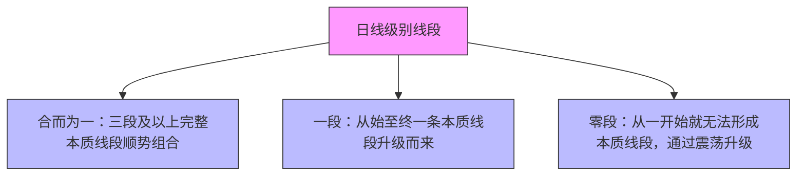

# 课22：二阶段讲七 — 本质走势中枢唯一（集中答疑）

## 一句话摘要

本质走势中枢唯一性的**集中答疑课**。本课非新知识点，而是针对学员在作业和圈子中暴露的共性问题进行梳理纠错。核心解决：中枢取值、线段识别、转折K、特殊顶底、零段/一段/三段分类。关键结论：**日线级别线段只有三种（合而为一、一段、零段），不存在虚线段/半段**；中枢取值由时间优先下34均线反向决定；最终要丢掉线段表象，眼中只有中枢上轨与看多区域。

---

## 一、课程定位与目标

| 维度 | 说明 |
|------|------|
| 所属阶段 | 第二阶段：走势中枢（课16~），本讲为中枢唯一性集中答疑 |
| 前置知识 | 课18~21：本质走势中枢定义、取值、唯一性、融汇精炼 |
| 课程性质 | **集中答疑课**，非新知识点 |
| 核心目标 | 针对学员作业和圈子中的共性问题进行梳理纠错，为走势分类和买卖点打下基础 |

### 核心原则

```
日线级别线段只有三种：合而为一 | 一段 | 零段
         ↓
    不存在"半段"或"虚线段"
         ↓
  必须建立连续性整体观
```

---

## 二、作业讲评一：任子行（重点案例）⭐

### 2.1 任子行的性质

| 维度 | 判定 |
|------|------|
| 类型 | **零段日线级别下跌线段**（非一段，非合而为一） |
| 成因 | 转折K为**双跳空**（价格跳空+实体跳空），无黑K → 不成本质线段，仅作虚线处理 |

### 2.2 转折K确认：双跳空规则

> 当出现**实体跳空 + 价格跳空**时，转折K成立，**无需考虑五均线新低/新高**。

学员常见错误：任子行的转折K无疑问，但对类似案例（如东华科技）却有疑问 → 规则掌握不严谨。

### 2.3 中枢取值（零段情况）

| 步骤 | 操作 |
|------|------|
| ① 定时间 | 由第二次出现的实体本质线段带来34均线反向 |
| ② 定波峰 | 以该线段转折K为起点，向左找34均线最高值（且前后有价差） |
| ③ 定波谷 | 以波峰为基准，向左找最低值（波谷1），向右找最低值（波谷2），**取较高者为下轨** |

> 该中枢由零段震荡升级为日线级别走势中枢（类似北玻股份）。

### 2.4 内部生长 vs 外部延伸

| 判断依据 | 结论 |
|----------|------|
| 五均线值持续创新低/新高 | **内部生长**，线段延续 |
| 五均线值不再创新低/新高，但K线创价格新低/新高 | **特殊顶底法则**触发，为无奈之下的特殊处理 |

### 2.5 三段线段识别

任子行中有三条连续的**完整本质线段**（无虚线），构成日线级别下跌线段基础，带来34均线反向最终形成日线级别走势中枢。

---

## 三、作业讲评二：东华科技

### 3.1 线段识别判断

| 情况 | 判定 |
|------|------|
| 有反正两穿 + 有黑K | ✅ 是线段 |
| 无黑K + 无5K重叠 + 无三笔 | ❌ 不是线段 |

### 3.2 特殊顶底的转折K ⚠️

> **常见错误**：将特殊顶底的底误认为转折K，导致时间区域错位。

**正解**：当出现特殊顶底时，转折K**不是离顶底最近的K**，而是五均线值真正开始转向的那根K（按本质生长定义）。

### 3.3 0.01元价差的中枢

| 维度 | 说明 |
|------|------|
| 价差 | 仅 0.01 元的34均线价差 |
| 类型 | 一段重叠中枢（非三段） |
| 法则 | 符合法则，应如实画出 |
| 实战含义 | 代表资金犹豫不决，可靠性较低 |

### 3.4 两个中枢 vs 震荡？

东华科技下跌过程中存在**两个日线级别走势中枢**（趋势性下跌），但第二个中枢在实战中从未产生有效买点。

---

## 四、常见错误与纠正（集中答疑要点）🔥

### 4.1 转折K的错误判断

**五均线同价（不新高/不新低）也视为有效转折**。

> 例：五均线值 5.21、5.21、5.21，同价 → 转折K在**第一根同价K**，而非之后。

### 4.2 34均线两侧的量化误解

| 条件 | 要求 |
|------|------|
| 成为顶 | K线五均线值 > 34均线值 |
| 成为底 | K线五均线值 < 34均线值 |
| 同价（=34均线） | ❌ **不能作为顶底** |

> 例：某K线五均线=34均线=9.42，即使后续有更高价，该点也不能作为线段顶。

### 4.3 "震荡"误认为"新中枢"

| 判断 | 说明 |
|------|------|
| 线段回到已有中枢内部 | 只是**中枢震荡**，不是新中枢 |
| 新中枢 | 必须由之前**未参与重叠的线段**带来新的34均线反向 |

### 4.4 日线级别线段与五均线值的关系 🔑

> **日线级别线段与五均线值毫无关系。五均线只用于本质线段（30分钟级别）。**

学员若始终盯着五均线去画日线级别线段，则永远无法摆脱局部视角。

### 4.5 丢掉"虚线段"思维 ⭐⭐⭐



> 不存在 0.5段、45段等半段概念。学习中的"45段"只是过渡，最终要丢掉。

---

## 五、看多区域与做多买点（前瞻）

| 条件 | 说明 |
|------|------|
| **看多** | 已有中枢后，需结合170均线进行走势分类，才能确定看多区域 |
| **做多** | 看多区域 + 结构买点（进攻买点/防守买点） |
| **反例** | 某股在中枢下轨处看似形成"进攻买点"，但因未突破170均线，看多区域不成立，随后大跌 |

> 仅凭中枢下轨或中枢内部形态，**无法判断买点**。看多 ≠ 做多。

---

## 六、大盘简评（讲课当时）

| 关键点位 | 3480 点（30分钟级别上涨结构成本位） |
|----------|-------------------------------------|
| 未破 | 仍属30分钟上涨 |
| 破 | 可能转为30分钟下跌 |

当时状态：30分钟上涨中的5分钟级别回撤，尚未确认30分钟下跌。

### 策略建议

| 对象 | 建议 |
|------|------|
| 老学员 | 个股有卖点则**减仓**（非清仓），做好滚动 |
| 新学员 | 继续学习，不急于交易 |

---

## 七、学习心态与建议

1. **独立思考与坚持**是学习的两个核心准则
2. 不要追求"每一步都完美再往前走"，学习是**螺旋式上升**，有些知识到后面回看才清晰
3. 交易的本质**不是预测未来**，而是在当下做正确的选择（风险可控、概率有利）
4. 股市赚钱不创造社会价值，建议盈利后适当**回馈社会**，以平衡因果

---

## 八、后续安排

| 事项 | 说明 |
|------|------|
| 下阶段 | 走势分类法则和级别的学习，之后是买卖点 |
| 作业 | 从明天起每天有作业（仅供练习中枢和分类，非买卖建议） |
| 节奏 | 下周可能开始新知识点，本周留给学员消化和查漏补缺 |

---

## 九、交叉引用

- [[courses/课21-走势中枢唯一融汇]] — 前置融汇精炼课
- [[courses/课23-走势中枢要点梳理]] — 后续要点梳理课
- [[courses/课18-本质走势中枢]] — 本质走势中枢定义
- [[courses/课19-走势中枢唯一取值]] — 中枢唯一取值方法
- [[courses/课17-日线级别线段]] — 日线级别线段四条件
- [[courses/摩尔缠论-高三课程体系]] — 53课总索引

---

## ⚠️ 待验证

- 双跳空规则与普通转折K的边界条件细化
- 零段日线级别线段震荡升级的精确量化触发条件
- 0.01元微小价差中枢在实战中的处理原则是否需额外过滤
